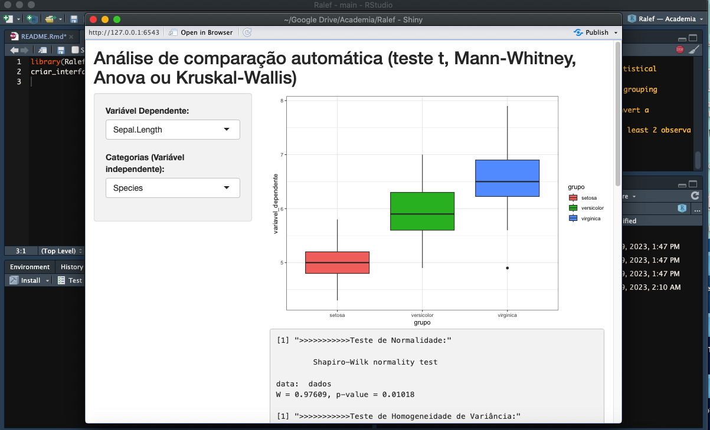

```{r setup, include=FALSE}
knitr::opts_chunk$set(echo = TRUE)
```

## Sobre o Ralef 

Esse pacote tem como objetivo automatizar trabalhos no R que geralmente
levam um considerável tempo 😅. O Ralef permite realizar análises
de forma automatizada selecionando as variáveis desejadas. Além disso, 
esse pacote permite a criação de gráficos com ggplot2 através da seleção 
de variáveis. Tudo isso em uma interface simples que é apresentada. 🙌

## Quais análises o pacote permite automatizar?

Até o momento, foram implementadas as opções de realizar o teste t,
Mann-Whitney, Anova e Kruskal-Wallis. Isso de forma automatizada. O pacote
verifica os pressupostos e decide qual teste deve ser realizado.

## Como instalar

```{r message=FALSE}
# Caso não tenha os pacotes instalados, remover o símbolo # antes das funções (install.packages).
# install.packages("devtools")
require(devtools)
# install_github("alefjonathan29/Ralef")
require(Ralef)
```

## Exemplo de uso das funções:

### Executando no R:

```{r}
testar_Ralef(iris$Sepal.Width, iris$Species)
```

### Criando a interface que permite selecionar as variáveis e criar o gráfico em ggplot2:
```{r eval=FALSE}
criar_interface(iris)

```



